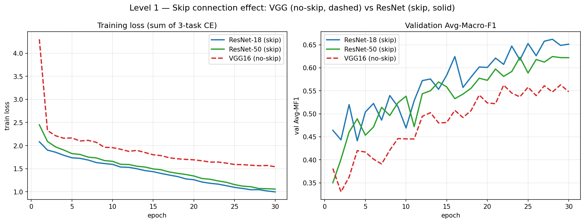
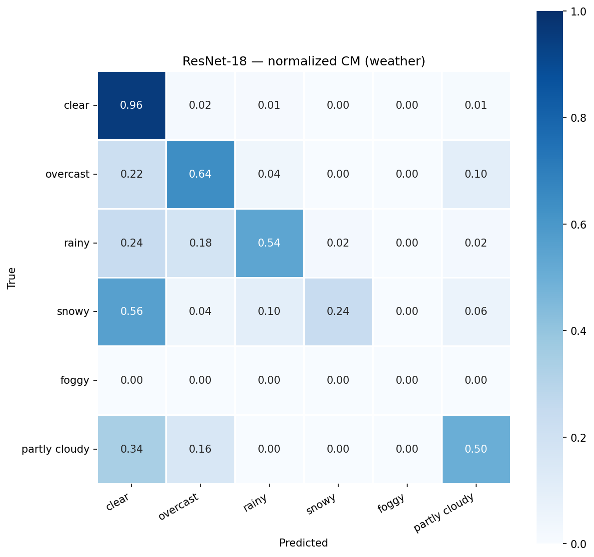
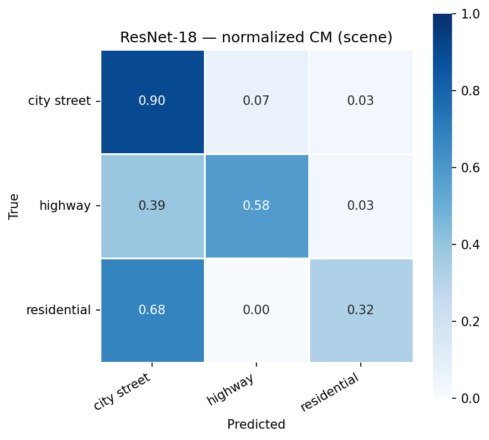
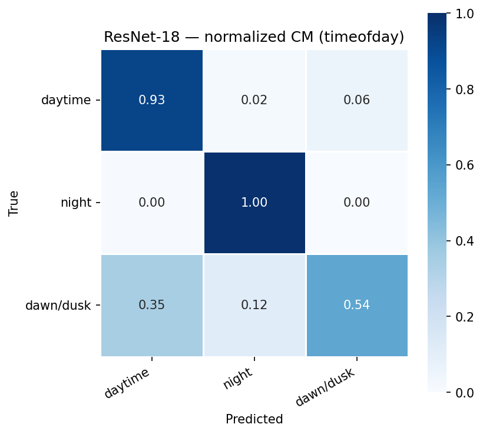

# Level 1 — Classic CNNs 결과 리포트

> PA2 Multi-task Scene Classification (weather / scene / timeofday, 3-head)
> 백본: VGG16(skip 없음) + ResNet-18/50(skip 있음) 직접 구현, 단일 백본 + 3-head multi-task
> 평가: Set A val, 메트릭 = Macro-F1(MF1), Avg-MF1 = 3속성(weather/scene/timeofday) MF1 평균, seed 42, fp32

## README Level 1 분석 포인트

이 리포트는 README가 요구하는 다음 두 분석 포인트를 다룬다.

- **(a)** Skip Connection 유무가 깊은 네트워크의 수렴에 미치는 영향
- **(b)** 3개 task의 loss 가중치 설정이 결과에 미치는 영향

---

## 1. 핵심 결과 Table

### Table 1. Backbone 비교 (Avg-MF1 / per-attribute MF1)

| Backbone | Skip | Avg-MF1 | weather | scene | timeofday |
|---|:---:|---:|---:|---:|---:|
| **ResNet-18** | yes | **0.6513** | 0.5072 | 0.6325 | 0.8142 |
| ResNet-50 | yes | 0.6220 | 0.5134 | 0.5739 | 0.7786 |
| VGG16 | no | 0.5479 | 0.3956 | 0.4676 | 0.7806 |

### Table 2. Top-1 / Worst-class Accuracy (속성별)

| Backbone | weather Top1 | weather worst | scene Top1 | scene worst | timeofday Top1 | timeofday worst |
|---|---:|---|---:|---|---:|---|
| ResNet-18 | 0.766 | 0.240 (snowy) | 0.748 | 0.321 (residential) | 0.938 | 0.538 (dawn/dusk) |
| ResNet-50 | 0.762 | 0.300 (snowy) | 0.718 | 0.207 (residential) | 0.924 | 0.461 (dawn/dusk) |
| VGG16 | 0.722 | 0.000 (snowy) | 0.700 | 0.000 (residential) | 0.938 | 0.346 (dawn/dusk) |

### Table 3. Per-class F1 — weather

| class | ResNet-18 | ResNet-50 | VGG16 |
|---|---:|---:|---:|
| clear | 0.876 | 0.869 | 0.862 |
| overcast | 0.604 | 0.604 | 0.562 |
| rainy | 0.614 | 0.598 | 0.406 |
| snowy | 0.375 | 0.441 | **0.000** |
| foggy | 0.000 | 0.000 | 0.000 |
| partly cloudy | 0.575 | 0.568 | 0.544 |

### Table 4. Per-class F1 — scene

| class | ResNet-18 | ResNet-50 | VGG16 |
|---|---:|---:|---:|
| city street | 0.819 | 0.796 | 0.783 |
| highway | 0.669 | 0.629 | 0.620 |
| residential | 0.410 | 0.297 | **0.000** |

### Table 5. Per-class F1 — timeofday

| class | ResNet-18 | ResNet-50 | VGG16 |
|---|---:|---:|---:|
| daytime | 0.941 | 0.931 | 0.942 |
| night | 0.983 | 0.976 | 0.981 |
| dawn/dusk | 0.519 | 0.429 | 0.419 |

### Table 6. (b) Loss-weight ablation — ResNet-18, 15ep quick run (상대 비교용)

| run (w_weather : scene : time) | Avg-MF1 | weather | scene | timeofday | Δ Avg vs 1:1:1 |
|---|---:|---:|---:|---:|---:|
| **1:1:1 (baseline)** | **0.6079** | 0.4973 | 0.4984 | 0.8280 | — |
| 2:1:1 | 0.6063 | 0.4947 | 0.4778 | 0.8465 | -0.0016 |
| 3:1:1 | 0.5820 | 0.4831 | 0.4800 | 0.7829 | -0.0259 |
| 1:1:2 | 0.5876 | 0.4648 | 0.4937 | 0.8043 | -0.0203 |

> 주의: 위 ablation은 **15ep quick run**이라 절대값이 30ep 본학습(Avg-MF1 약 0.65)보다 낮다. **상대 비교 용도로만** 해석한다.

---

## 2. 분석 (a) — Skip Connection이 수렴에 미치는 영향

ResNet-18/50(skip 있음)과 VGG16(skip 없음)을 동일 조건으로 비교한 결과, **skip connection이 있는 백본이 Avg-MF1 전 구간에서 우위**다 (ResNet-18 0.6513, ResNet-50 0.6220 vs VGG16 0.5479; Table 1).

차이는 **다수 클래스가 아니라 소수 클래스에서 결정적으로 벌어진다.** clear(weather)·daytime/night(timeofday) 같은 다수 클래스의 per-class F1은 세 백본이 거의 동일하다 (clear 0.876/0.869/0.862, night 0.983/0.976/0.981; Table 3, 5). 반면 소수 클래스에서는 VGG16이 **완전히 붕괴**한다.

- weather **snowy**: ResNet-18 0.375 / ResNet-50 0.441 / VGG16 **0.000** (Table 3)
- scene **residential**: ResNet-18 0.410 / ResNet-50 0.297 / VGG16 **0.000** (Table 4)
- rainy도 VGG16(0.406)이 ResNet-18(0.614)·ResNet-50(0.598) 대비 크게 낮다.

Worst-class accuracy(Table 2)도 같은 신호를 준다. VGG16은 snowy·residential의 worst-class accuracy가 **0.000**으로, 해당 소수 클래스를 단 한 장도 맞히지 못했다. ResNet 계열은 같은 클래스에서 0.207~0.321 수준으로나마 학습이 진행됐다.

**해석**: skip connection은 gradient가 깊은 망을 통과해 흐르도록 도와 수렴을 안정화하고, 그 효과가 학습 신호가 약한(샘플 적은) 소수 클래스까지 미친다. skip이 없는 VGG16은 다수 클래스 위주로만 수렴하고 소수 클래스는 학습되지 못해, 소수 클래스 F1이 0으로 무너지면서 Avg-MF1이 낮아진다.

**ResNet-50 < ResNet-18 (역전 현상)**: skip이 있는데도 더 깊은 ResNet-50이 ResNet-18보다 Avg-MF1이 낮다 (0.6220 < 0.6513). weather에서는 ResNet-50이 근소 우위(0.5134 vs 0.5072)지만, scene(0.5739 vs 0.6325)·timeofday(0.7786 vs 0.8142)에서 뒤처져 평균이 역전됐다. Set A train이 약 5천 장 규모로 작아 50층 용량이 과한(과적합 / under-converge 가능성) 것으로 보인다 (추측). 즉 "깊을수록 좋다"가 아니라, **데이터 규모에 맞는 깊이 선택이 중요**하다는 점을 보여준다.

*Figure 1. VGG16(skip 없음)과 ResNet(skip 있음)의 학습 손실 곡선 비교.*

**데이터 한계 — foggy**: weather의 **foggy는 세 백본 모두 F1 = 0.000**이다 (Table 3). 이는 백본 성능 문제가 아니라 **Set A train에 foggy 샘플이 0장**이어서 학습 자체가 불가능한 데이터 한계다. skip 분석에서 foggy는 제외하고 해석해야 한다.

---

## 3. 분석 (b) — 3-task Loss 가중치의 영향

ResNet-18로 loss 가중치(weather : scene : timeofday)를 바꿔가며 비교했다 (Table 6, 15ep quick run, 상대 비교용).

- **1:1:1 (baseline)**: Avg-MF1 0.6079로 **가장 높다.**
- **2:1:1** (weather 가중↑): Avg-MF1 0.6063 (Δ -0.0016). timeofday는 +0.019 올랐으나 scene이 -0.021로 깎였다. weather 자체는 -0.003으로 거의 이득 없음.
- **3:1:1** (weather 가중 더↑): Avg-MF1 0.5820 (Δ -0.0259). timeofday가 -0.045로 크게 하락하며 평균을 끌어내렸다.
- **1:1:2** (timeofday 가중↑): Avg-MF1 0.5876 (Δ -0.0203). weather가 -0.033으로 희생됐다.

**해석**: multi-task 공유 백본에서 한 task의 loss 가중을 키우면 그 task가 비례해서 좋아지기보다, **다른 task가 깎이는 trade-off**가 두드러진다.

- weather 가중↑ → scene·(과하면)timeofday 희생 (2:1:1, 3:1:1)
- timeofday 가중↑ → weather 희생 (1:1:2)

네 설정 모두 baseline 대비 Avg-MF1이 같거나 낮았고(Δ ≤ 0), 가중을 한쪽으로 더 밀수록(3:1:1) 손해가 커졌다. 따라서 **균등 가중 1:1:1을 채택**한다. 이는 단순함뿐 아니라, 한 task 편애가 평균 메트릭(Avg-MF1)을 깎는다는 데이터에 근거한 선택이다.

> 절대값 주의: 15ep quick run이라 본학습(약 0.65)보다 낮다. 위 결론은 **설정 간 상대 순위**에 한정한다.

---

## 4. ResNet-18 속성별 Confusion Matrix (정규화)

대표 백본인 ResNet-18의 속성별 정규화 confusion matrix를 첨부한다. Worst-class(Table 2: snowy / residential / dawn/dusk)에서의 혼동 양상을 확인할 수 있다.

*Figure 2. ResNet-18 weather 정규화 confusion matrix.*

*Figure 3. ResNet-18 scene 정규화 confusion matrix.*

*Figure 4. ResNet-18 timeofday 정규화 confusion matrix.*

---

## 5. 통합 리포트용 핵심 메시지

- **Best 백본 = ResNet-18** (Avg-MF1 0.6513). ResNet-50(0.6220), VGG16(0.5479) 순.
- **(a) Skip의 효과는 소수 클래스에서 결정적**: 다수 클래스 F1은 세 백본이 거의 동일하나, skip 없는 VGG16은 snowy·residential F1이 **0.000**으로 붕괴 → skip connection이 gradient 흐름/수렴을 도와 소수 클래스까지 학습.
- **더 깊다고 항상 좋지 않다**: skip이 있어도 ResNet-50 < ResNet-18 → Set A 약 5천 장 규모에 50층은 과한 용량으로 추정.
- **(b) Loss 가중은 1:1:1이 최선**: 한 task 가중을 키우면 다른 task가 깎이는 trade-off가 지배적이고, 모든 비균등 설정이 baseline 대비 Avg-MF1 동일 또는 하락 → **균등 가중 채택을 데이터로 정당화**.
- **데이터 한계 명시**: foggy는 train 0장이라 모든 백본 F1 = 0.000 → 모델이 아닌 데이터 문제 (Level 3/5 불균형·큐레이션의 동기).
