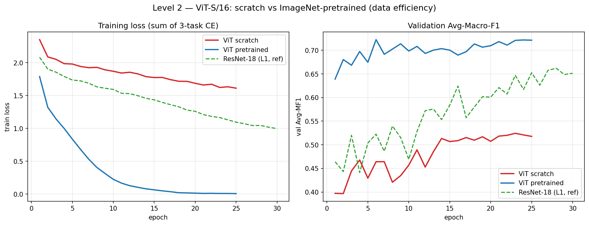
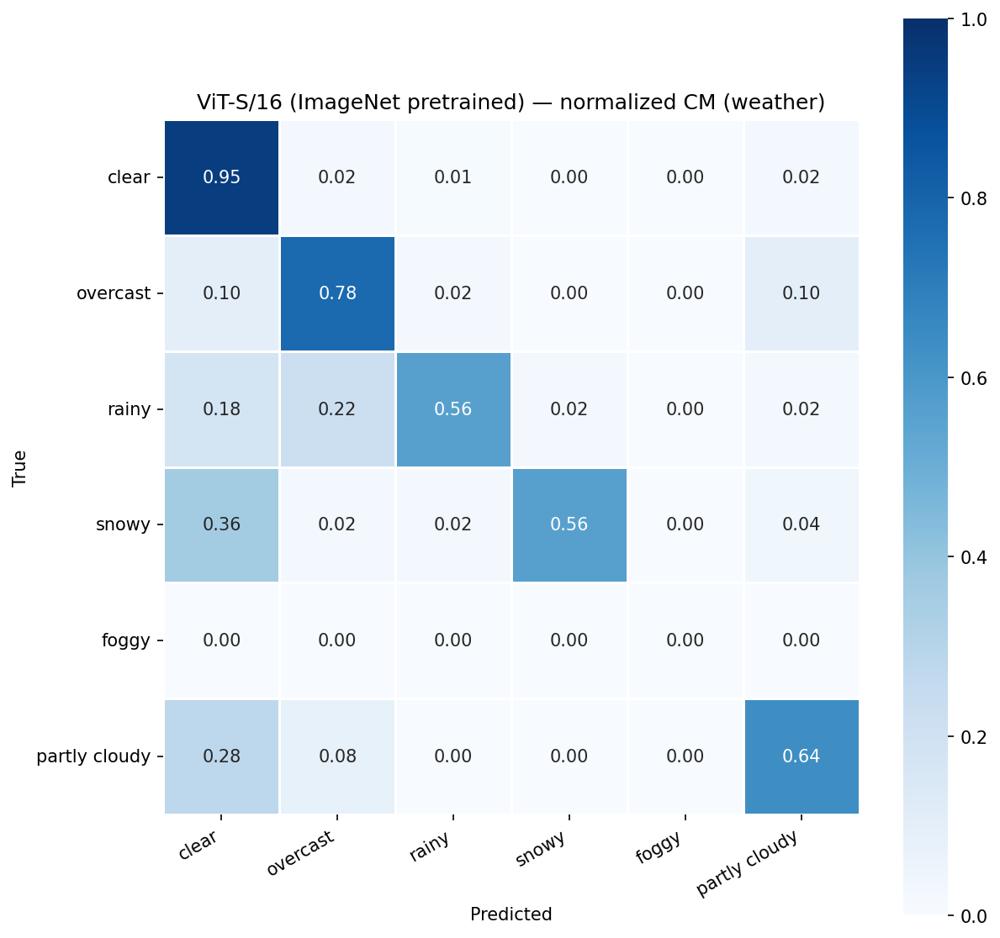
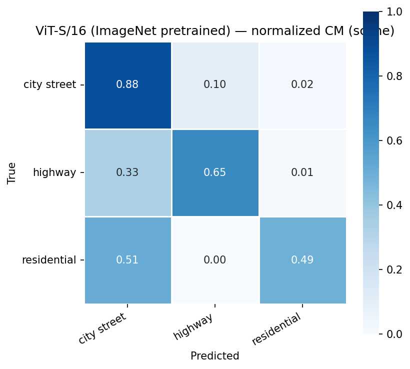
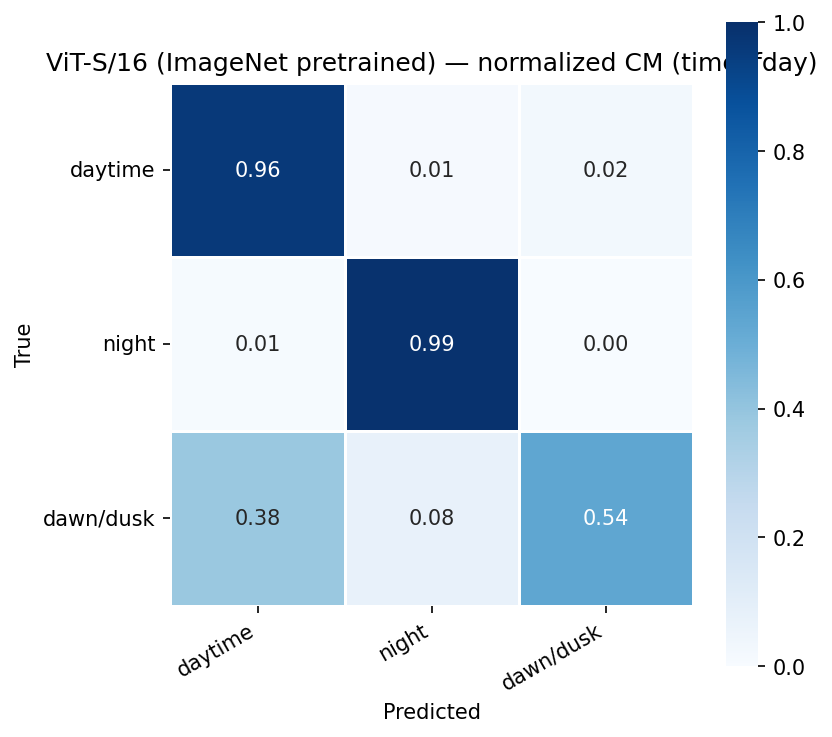
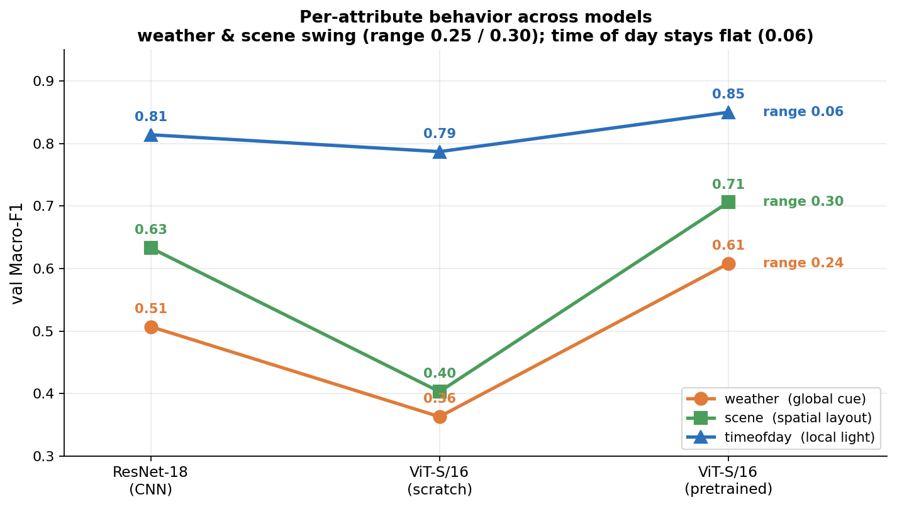

# Level 2 — Vision Transformers (ViT-S/16)

## 분석 포인트 (README 기준)

CNN 대비 Attention 기반 모델의 다음 두 측면을 소규모·불균형 데이터셋(Set A)에서 분석한다.

- **(a) 데이터 효율성** — ViT가 동일 데이터량에서 CNN만큼 학습되는가.
- **(b) Inductive bias 부재의 영향** — locality·translation equivariance 같은 prior가 없을 때 소수·불균형 클래스에서 어떤 일이 일어나는가.

### 실험 설정
- **모델**: ViT-S/16 직접 구현 (`dim=384`, `depth=12`, `heads=6`, `patch=16`).
- **Pretrained remap**: ImageNet pretrained `.pth`를 본인 구현 `state_dict`에 remap — backbone **150/150 keys** 매칭, multi-task head는 random init.
- **출처**: timm `vit_small_patch16_224.augreg_in1k` (라이브러리 import가 아니라 weight 텐서만 remap).
- **평가**: Set A val, `seed=42`, fp32.

---

## 결과 Table

### 모델 비교 (Avg-MF1 / 속성별 MF1)

| Model | Avg-MF1 | weather | scene | timeofday |
|---|---|---|---|---|
| ResNet-18 (Level 1) | 0.6513 | 0.5072 | 0.6325 | 0.8142 |
| ViT-S/16 scratch | 0.5178 | 0.3634 | 0.4030 | 0.7869 |
| ViT-S/16 ImageNet pretrained | 0.7214 | 0.6076 | 0.7064 | 0.8502 |

> 참고: 0.7214는 Level 2 기준 ViT-pretrained val 수치다. 이후 Level 3에서 best가 0.7301로 갱신되나, 본 Level 2 문서에서는 0.7214를 사용한다.

### Per-class F1 — ViT scratch → pretrained

| 속성 | 클래스 | scratch | pretrained |
|---|---|---|---|
| weather | clear | 0.849 | 0.902 |
| weather | overcast | 0.576 | 0.703 |
| weather | rainy | 0.111 | 0.675 |
| weather | snowy | 0.000 | 0.700 |
| weather | foggy | 0 | 0 |
| weather | partly cloudy | 0.644 | 0.667 |
| scene | city street | 0.765 | 0.827 |
| scene | highway | 0.444 | 0.694 |
| scene | residential | 0.000 | 0.598 |
| timeofday | daytime | 0.933 | 0.957 |
| timeofday | night | 0.983 | 0.985 |
| timeofday | dawn/dusk | 0.444 | 0.609 |

### 학습 곡선

---

## (a) 데이터 효율성

Set A의 train은 약 5천 장으로 소규모다. 이 regime에서 ViT를 scratch로 학습한 결과(Avg-MF1 **0.5178**)는 동일 데이터로 학습한 ResNet-18 CNN(**0.6513**)보다 낮다. 즉 attention 기반 특징을 데이터만으로 처음부터 학습하기에는 5천 장이 부족하다.

반면 ImageNet pretrained weight를 remap한 ViT는 fine-tune만으로 Avg-MF1 **0.7214**에 도달한다. scratch 대비 단일 변수(가중치 초기값)만 다른 비교에서 **+0.2037** Avg-MF1의 향상이다. 이는 ViT가 데이터 효율이 낮아 transfer learning 의존도가 크다는 것을 직접 보여준다 — 대규모 사전학습이 공급하는 표현을 빌려야 소규모 데이터에서 경쟁력이 생긴다.

학습 곡선(`level2_curves.png`)에서 scratch와 pretrained의 수렴 거동 차이를 함께 참조한다.

---

## (b) Inductive bias 부재의 영향

CNN은 locality와 translation equivariance를 convolution 연산에 구조적으로 내장하고 있어, 소수 라벨만으로도 일반화가 가능하다. ViT는 이러한 prior가 없어 그것마저 데이터로 학습해야 하므로, prior가 가장 절실한 소수·불균형 클래스에서 먼저 붕괴한다.

scratch ViT의 per-class F1을 보면 소수 클래스가 실제로 무너진다:
- weather **snowy 0.000**, **rainy 0.111**
- scene **residential 0.000**
- timeofday **dawn/dusk 0.444**

ImageNet pretraining은 이 inductive bias를 암묵적으로 공급한다. 그 결과 동일 소수 클래스들이 회복된다:
- weather **snowy 0.000 → 0.700**, **rainy 0.111 → 0.675**
- scene **residential 0.000 → 0.598**, **highway 0.444 → 0.694**
- timeofday **dawn/dusk 0.444 → 0.609**

다만 **foggy는 scratch·pretrained 모두 0**이다. 이는 사전학습으로도 풀리지 않는 별도 요인(Set A train의 foggy 라벨 부재)에 기인하며, pretraining이 만능이 아님을 보여주는 대비점이다.

best ViT(pretrained)의 속성별 정규화 Confusion Matrix를 참조한다.

---

## (c) 속성별 오류 거동 — ViT vs ResNet의 속성별 민감도 차이

> 노트북 분석 3: ViT가 ResNet 대비 속성 간 오류 분포를 다르게 가져가는가, 그 원인은.

세 모델 모두 **timeofday > scene > weather** 순서(weather가 최약 속성)는 공통이다. 그러나 *모델을 바꿨을 때 각 속성이 얼마나 흔들리는지*(변동폭, range = 모델 간 max−min)는 속성마다 크게 다르다.

| 속성 | ResNet-18 (CNN) | ViT scratch | ViT pretrained | **변동폭(range)** | 핵심 단서 |
|---|---:|---:|---:|---:|---|
| timeofday | 0.814 | 0.787 | 0.850 | **0.06 (거의 불변)** | 전체 밝기·광원 |
| weather | 0.507 | 0.363 | 0.608 | 0.25 | 하늘 흐림·노면 텍스처 |
| scene | 0.633 | 0.403 | 0.706 | **0.30 (최대)** | 차선·건물 = 공간 배치 |

ViT-pretrained의 ResNet 대비 이득도 같은 순서다 — **weather +0.100, scene +0.074, timeofday +0.036**. 즉 **timeofday는 모델을 어떻게 바꿔도 거의 불변(0.79~0.85)**, **weather·scene은 scratch에서 붕괴하고 pretrained에서 도약**한다. 특히 **scene이 변동 최대(0.30)** 로 scratch에서 0.633→0.403까지 무너진다(per-class residential **0.000→0.598**).

### 원인 가설 — "국소/전역"이 아니라 "신호 강도 × 통합 필요성"

ViT가 ResNet 대비 오류를 다르게 분배하는 것은 사실이며, 그 차이는 **timeofday에는 거의 없고 weather·scene에 집중**된다. 단순한 "국소 vs 전역" 라벨로는 부정확하고, 두 축으로 설명하는 편이 정확하다(추측).

**① 신호 강도(redundancy) — timeofday가 불변인 이유.** daytime/night는 **밝기**라는 매우 강한 신호로 갈리고, 이 신호는 이미지 전체에 **중복(redundant)** 되어 있다. 전역 통합 없이 **국소 패치 하나로도 풀리므로** 아키텍처(CNN/ViT)나 가중치(scratch/pretrained)와 무관하게 쉽다 → 거의 불변. (즉 "국소라서 쉬운" 것이 아니라 "강하고 중복된 신호라 어떤 방식으로 봐도 쉬운" 것이다.)

**② 통합 필요성 — weather·scene이 민감한 이유(서로 다름).**
- **scene**: 차선 수·건물 배치 같은 **공간 구조를 넓은 영역에서 통합**해야 한다(진짜 전역). ViT의 long-range attention이 강점인 영역.
- **weather**: clear↔overcast처럼 **미묘한 fine-grained 텍스처**(하늘 흐림 정도·노면 상태)를 종합해야 한다. 신호가 약하고 미세하다.
- 두 속성 모두 ViT의 강점(전역 attention + pretrained의 풍부한 텍스처·공간 표현)이 작동하는 영역이라, **scratch면 그 표현을 5천 장으로 못 배워 붕괴**하고 **pretrained면 transfer로 회복·초월**한다 → 변동 큼.

**종합.** timeofday는 강하고 중복된 밝기 신호라 모델 무관(불변), weather·scene은 각각 미묘한 텍스처 종합 / 공간 배치 통합이 필요해 ViT 특성에 민감하다. timeofday 내에서도 dawn/dusk(광원 경계 모호, per-class **0.444→0.609**)만 pretrained에서 개선되어, "통합·맥락이 필요한 케이스에서만 ViT 이득"이라는 설명을 보강한다.

---

## Takeaway

소규모·불균형 regime에서 ViT는 scratch로는 CNN 대비 비경쟁적이지만, ImageNet pretrained weight를 본인 구현에 remap하면 가장 강한 백본이 된다.

---

## 통합 리포트용 핵심 메시지

- **scratch ViT(0.5178) < ResNet-18 CNN(0.6513)** — 동일 5천 장 데이터에서 scratch ViT는 CNN보다 낮다. ViT는 데이터 효율이 낮다.
- **pretrained ViT(0.7214) > CNN(0.6513)** — ImageNet remap fine-tune만으로 최강 백본이 된다.
- **scratch → pretrained delta = +0.2037 Avg-MF1** — 단일 변수(가중치 초기값)만 다른 비교. transfer 의존도가 크다는 직접 증거.
- **inductive bias 부재 → 소수 클래스 붕괴**: scratch에서 snowy 0.000, residential 0.000, rainy 0.111. pretraining이 prior를 암묵 공급하여 snowy 0.700, residential 0.598, rainy 0.675로 회복.
- **pretraining도 만능 아님**: foggy는 scratch·pretrained 모두 0 (Set A train foggy 라벨 부재).
- backbone remap **150/150 keys** 매칭, head random init — 라이브러리 import 없이 weight 텐서만 사용 (출처: timm `vit_small_patch16_224.augreg_in1k`).
- **(c) 속성별 오류 거동**: ViT의 변화는 weather에 집중(이득 +0.100, 최대)·timeofday에 미미(+0.036). weather↔timeofday 격차 = scratch ViT 0.424(최대) → pretrained ViT 0.243(최소). 가설: weather=전역 맥락 속성→attention 특성에 민감, timeofday=국소 광원 신호→모델 불변.
