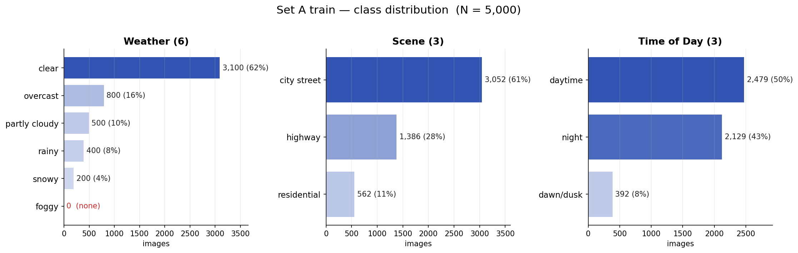
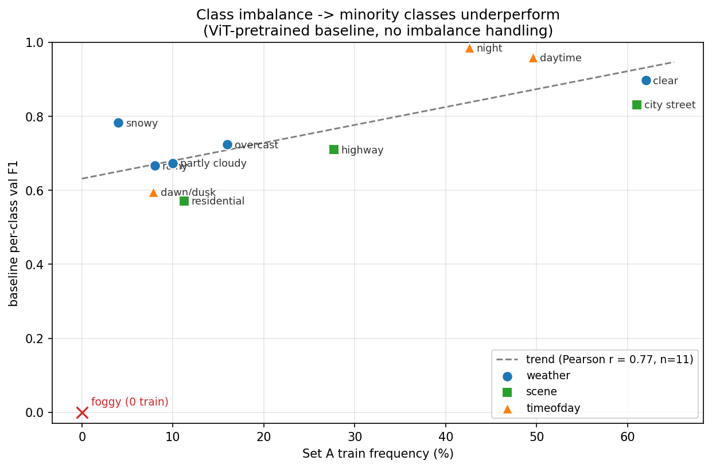
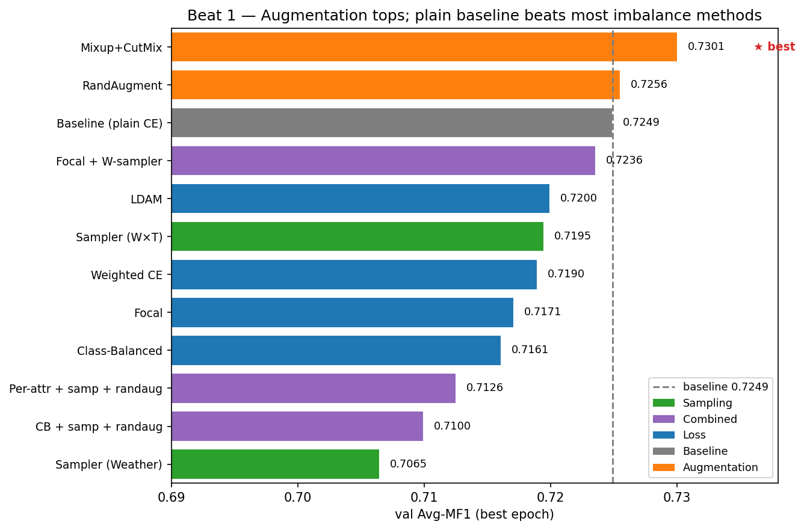
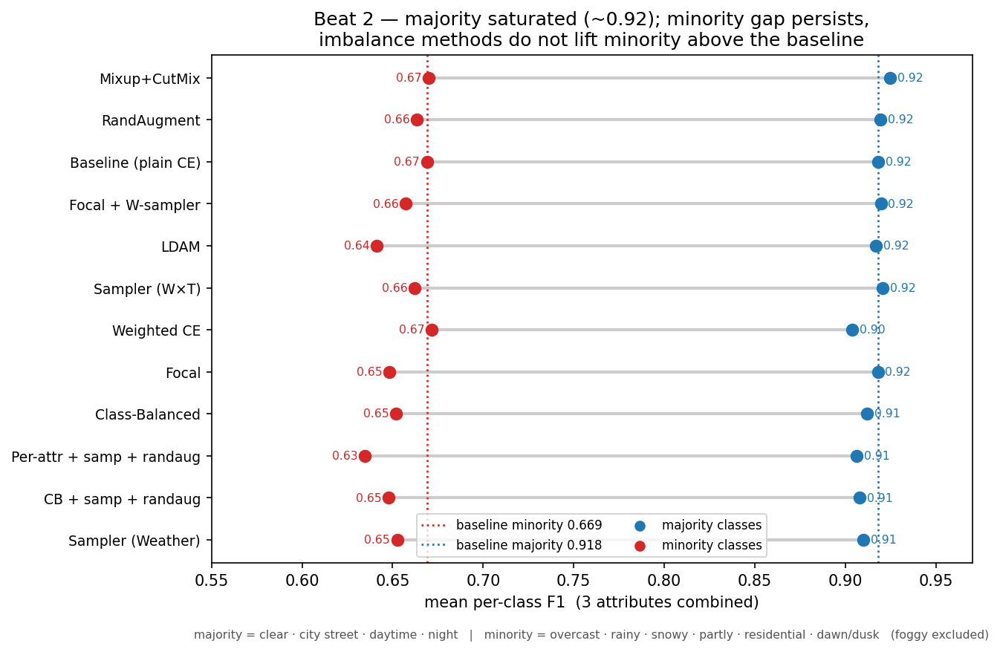
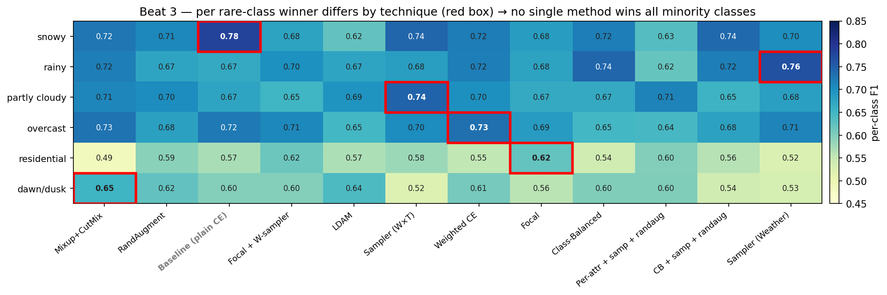

# Level 3 — Imbalance & Augmentation 결과 리포트

통합 리포트(.pptx)용 정리본. Set A 클래스 불균형 대응으로 **Loss / Sampling / Augmentation** 3개 axis 기법을 조합해 ViT-S/16(Level 2 best, ImageNet-pretrained) 위에서 **12개 ablation**.

- 백본: ViT-S/16 (ImageNet-pretrained) · HP: AdamW lr 1e-4 / wd 5e-2 / Cosine / 25 ep / batch 64 / AMP fp16 / seed 42
- 지표: Avg-MF1 = (MF1_weather + MF1_scene + MF1_timeofday) / 3, **Set A val**
- **모든 수치 = best-Avg-MF1 epoch 기준** — 배포 체크포인트(`level3_best.pth`)가 그대로 재현하며, per-attribute 3개 평균 = Avg-MF1로 검산 일치.

## 동기 — 불균형이 소수 클래스 성능을 직접 떨어뜨린다

Set A train은 weather **clear 62% vs snowy 4% (foggy 0장)**, scene city 61% vs residential 11%, timeofday daytime 50% vs dawn/dusk 8%로 강한 long-tail.

불균형 대응이 없는 baseline(plain CE)에서 **클래스 학습 빈도와 per-class F1은 양의 상관**(Pearson *r* = 0.78) — 즉 소수 클래스일수록 성능이 낮다. 이것이 Level 3 기법의 출발 동기다.

---

## 결과 Table (12-run, best-epoch 일관)

| Technique | Loss | Sampler | Aug | Avg-MF1 | Δ base | weather | scene | timeofday |
|---|---|---|---|---:|---:|---:|---:|---:|
| **Baseline** | — | — | — | 0.7249 | ref | 0.624 | 0.704 | 0.846 |
| **Loss** ldam | LDAM | — | — | 0.7200 | −0.0050 | 0.588 | 0.710 | **0.862** |
| **Loss** wce | Weighted CE | — | — | 0.7190 | −0.0060 | 0.628 | 0.681 | 0.848 |
| **Loss** focal | Focal | — | — | 0.7171 | −0.0078 | 0.602 | 0.718 | 0.831 |
| **Loss** cb | Class-Balanced | — | — | 0.7161 | −0.0088 | 0.613 | 0.690 | 0.846 |
| **Samp** joint | — | Joint (W×T) | — | 0.7195 | −0.0054 | 0.630 | 0.708 | 0.820 |
| **Samp** weather | — | Weather-bal. | — | 0.7065 | −0.0185 | 0.624 | 0.679 | 0.817 |
| **Aug** mixup+cutmix ⭐ | — | — | Mixup+CutMix | **0.7301** | **+0.0051** | 0.631 | 0.692 | **0.867** |
| **Aug** randaug | — | — | RandAugment | 0.7256 | +0.0006 | 0.612 | 0.708 | 0.857 |
| **Comb** focal+samp | Focal | Weather-bal. | — | 0.7236 | −0.0013 | 0.606 | 0.718 | 0.846 |
| **Comb** perattr+samp+rand | Per-attr† | Weather-bal. | RandAugment | 0.7126 | −0.0124 | 0.585 | 0.706 | 0.847 |
| **Comb** cb+samp+rand | Class-Balanced | Weather-bal. | RandAugment | 0.7100 | −0.0150 | 0.613 | 0.693 | 0.824 |

†Per-attr = 속성별 다른 loss(weather:LDAM / scene:CB / timeofday:CE). Δ base = Avg-MF1 − baseline(0.7249). 전체 표·Legend: `tables/level3_results_clean.md`.

---

## Beat 1 — 무엇이 최고였나: 증강 우위, 표준 불균형 기법은 baseline에도 못 미침

- **best = Mixup+CutMix 0.7301** (증강), 2위 RandAugment 0.7256.
- **baseline(plain CE) 0.7249가 3위** — Loss(focal/cb/ldam/wce)·Sampling·Combined **거의 전부를 앞선다**. baseline을 넘은 건 증강 2종(Δ +0.0051 / +0.0006)뿐이고, **나머지 9개 기법은 모두 Δ < 0**.
- 가장 복잡한 조합(cb+samp+randaug Δ −0.0150, sampler-weather Δ −0.0185)이 오히려 최하위.
- **해석**: pretrained ViT는 이미 강한 표현을 갖고 있어, loss 재가중/재샘플링은 추가 이득보다 학습 불안정을 더 유발. 단순한 데이터 증강(다양성 ↑)만이 안전하게 Avg-MF1을 끌어올린다.

## Beat 2 — best도 소수가 약점이고, 불균형 기법도 소수를 baseline 위로 못 올린다 (왜)

**다수/소수 정의 (3속성 통합, weather 단독 아님)** — train 빈도 기준:

| 속성 | 다수 (≥40%) | 소수 (≤16%) | 분석 제외 |
|---|---|---|---|
| weather | clear (62%) | overcast(16%) · rainy(8%) · snowy(4%) · partly(10%) | foggy (0장) |
| scene | city street (61%) | residential (11%) | highway (28%, 중간) |
| timeofday | daytime(50%) · night(43%) | dawn/dusk (8%) | — |
| **합계** | **4 클래스** | **6 클래스** | foggy · highway |

> Beat 2의 파랑(다수)/빨강(소수) 점은 위 4개 / 6개 클래스의 F1을 각각 평균한 값이다. highway(28%)는 다수·소수 어디에도 속하지 않아 제외, foggy(0장)는 학습 불가라 제외.

- **다수 클래스 F1은 모든 기법에서 ~0.92로 포화** — 다수는 병목이 아니다.
- **best(mixup)조차 다수 0.925 vs 소수 0.670, gap 0.255 잔존** — 불균형이 best에서도 남는다.
- **표준 불균형 기법이 소수 평균을 baseline(0.669) 위로 못 끌어올림**: ldam 0.641 · focal 0.648 · cb 0.652 · sampler-weather 0.653로 **오히려 baseline보다 낮다**. baseline에 도달한 건 wce 0.672 · mixup 0.670 정도(차이 noise 수준).
- **다수↔소수 trade-off는 없다** (corr(다수,소수) = +0.35). 즉 "소수를 살리려 다수를 깎는" 고전적 trade-off가 아니라, 다수는 고정된 채 소수만 기법마다 미세 변동.
- **해석**: pretrained baseline이 소수를 이미 상당 부분 처리(소수평균 0.669)하고 있어, 재가중이 주는 한계 이득 < 학습 불안정 손해. 불균형 기법의 효과는 **소수 평균(aggregate)에 희석**되어 거의 안 보인다.

## Beat 3 — 개별 소수 클래스에선 특정 기법이 이긴다, 단 trade-off는 "소수↔소수(속성 간)" (왜)

- **희귀 클래스별 winner가 제각각** (빨간 박스):
  - rainy → **Sampler(Weather)** 0.765 (baseline 0.667, **+0.098**)
  - dawn/dusk → **Mixup+CutMix** 0.652 (baseline 0.596, +0.056)
  - residential → **Focal** 0.621 (baseline 0.571, +0.050)
  - partly cloudy → **Sampler(W×T)** 0.745, overcast → **Weighted CE** 0.733
  - snowy → **Baseline** 0.783 — 기법이 baseline을 못 넘는 경우도 있다.
- 이긴 이유: 해당 소수 클래스에 gradient/sampling 비중을 키운 효과.
- **trade-off의 실체**: 그 이득이 aggregate·다수에 안 나타나는 이유는, **같은 기법이 다른 소수를 깎기 때문**. 예) **Sampler(Weather)는 rainy 최고(0.765)지만 전체 Avg는 꼴찌(0.7065)** — rainy를 살리며 weather의 다른 소수·scene·timeofday를 희생. → multi-task에서 **한 sampler/loss로 3속성·전 소수를 동시에 못 살린다**(README 핵심 난점).
- **속성 간 충돌 직접 사례**: **LDAM은 timeofday 0.862(12-run 최고)지만 weather 0.588(최저)** — 동일 loss가 한 속성엔 유효, 다른 속성엔 역효과. ⇒ loss/sampler를 전 속성 일괄 적용하면 안 되고 속성별 설계가 필요.

---

## 한계 — foggy 전역 0장

train·val·set_b 전 구간에 foggy 라벨 0장 → 재가중·샘플링·증강 무엇으로도 학습 불가, 12-run 전부 foggy F1 = 0.000. weather는 실질 **5클래스 문제**이며 6클래스 평균에 0이 상수로 깔린다. Level 5 set_b 큐레이션으로도 해소 불가.

---

## 통합 리포트용 핵심 메시지 (PPT)

- **best = Mixup+CutMix 0.7301** (증강), baseline 0.7249 대비 Δ +0.0051. **증강 2종만 baseline 초과, 나머지 9개 기법은 baseline 미만.**
- **다수 포화(~0.92)·소수 정체**: best조차 다수0.925 / 소수0.670 gap 0.255. 표준 불균형 기법(ldam·focal·cb)은 소수를 baseline(0.669) 위로 못 올림.
- **다수↔소수 trade-off 없음** (corr +0.35) — 다수는 고정, 소수만 변동.
- **희귀 클래스별 winner 상이**: rainy→Sampler(W)+0.098, residential→Focal+0.050, dawn/dusk→Mixup+0.056, snowy→Baseline. 단일 기법으로 전 소수 동시 개선 불가.
- **속성 간 충돌**: LDAM = timeofday 최고(0.862)·weather 최저(0.588); Sampler(Weather) = rainy 최고지만 Avg 최저. → multi-task는 속성별 설계 필요.
- **한계**: foggy 전역 0장 → weather 실질 5클래스, 모든 기법에서 F1 = 0.
