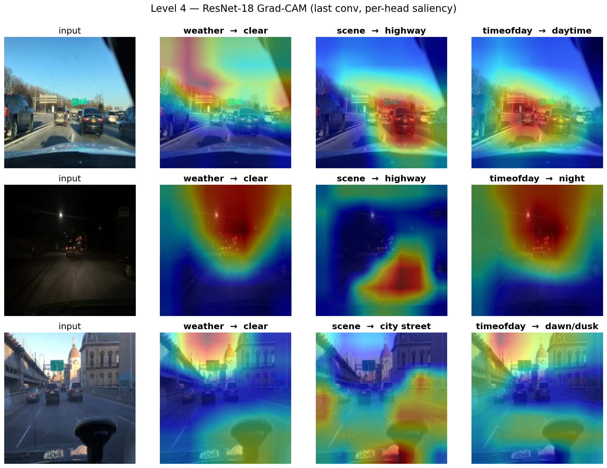
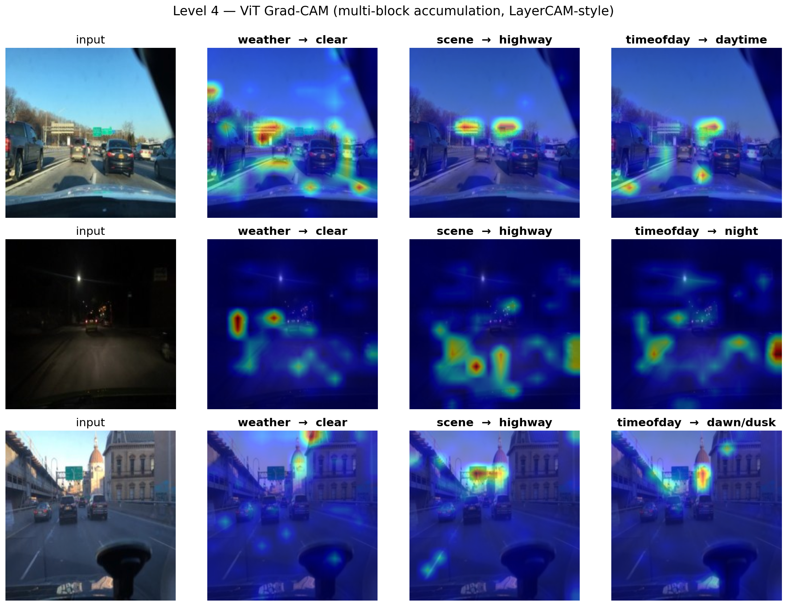
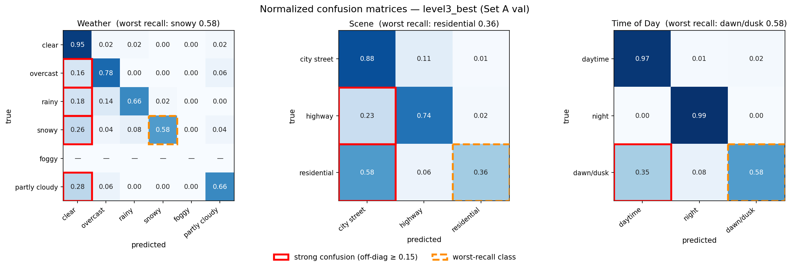
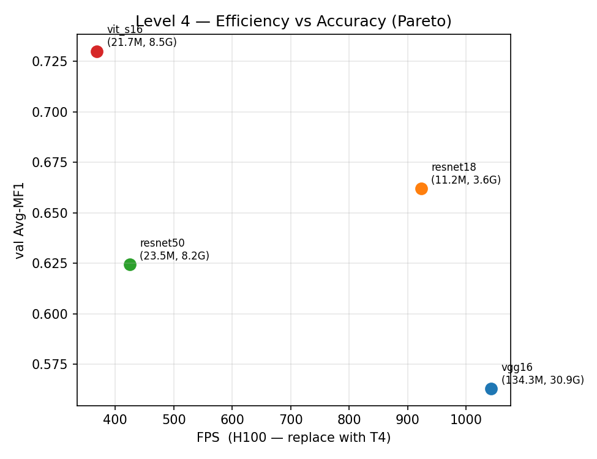

# Level 4 — XAI & Efficiency 결과 리포트

> PA2 Multi-task Scene Classification 통합 리포트(.pptx)용 정리본.
> 단일 백본 + 3-head(weather / scene / timeofday) 구조에 대한 해석 가능성(XAI), 혼동 패턴(Confusion Matrix), 효율성 트레이드오프(Efficiency)를 분석한다.

## 분석 포인트

본 Level의 README 분석 포인트는 다음 3가지다.

1. **XAI (Grad-CAM)** — 동일 이미지에 대해 세 head(weather / scene / timeofday)가 각각 어디를 보는지 시각화하고, multi-task 학습이 head 간 attention을 어떻게 분산시키는지 해석한다.
2. **Confusion Matrix 분석** — 속성별 3개 CM에서 어떤 클래스 쌍이 혼동되는지, 그 원인이 텍스처인지 광원인지 가설을 세운다.
3. **Efficiency Trade-off** — FPS vs Avg-MF1 Pareto front를 그리고, Params / FLOPs를 함께 첨부해 효율-정확도 균형을 논한다.

---

## 기본 결과 (Efficiency Table)

| backbone | Params (M) | FLOPs (G) | FPS (H100 참고) | Avg-MF1 |
|---|---|---|---|---|
| vgg16 | 134.32 | 30.93 | 1042.7 | 0.5629 |
| resnet18 | 11.18 | 3.63 | 922.7 | 0.6620 |
| resnet50 | 23.53 | 8.17 | 424.5 | 0.6244 |
| vit_s16† | 21.67 | 8.48 | 368.2 | 0.7301 |

† vit_s16 Avg-MF1 0.7301 = Level 3 best(mixup-cutmix, best-epoch) 기준이며 `level3_best.pth` eval로 재현된다. 순수 baseline ViT(plain CE)는 0.7249.

> **주의 (채점 기준)**: Params와 FLOPs는 하드웨어와 무관한 모델 고유값이라 그대로 사용한다. 그러나 위 표의 **FPS는 H100에서 측정한 참고용 값**이며, **채점용 FPS는 반드시 T4 GPU에서 재측정**해야 한다. 특히 vgg16이 H100에서 가장 빠르게(1042.7) 나온 것은 H100의 대규모 연산 처리량에 기인한 것으로, 메모리 대역폭과 코어 구성이 다른 T4에서는 동일한 순위가 보장되지 않는다.

---

## 1. XAI (Grad-CAM)

> **head-divergence 측정**: 각 head CAM을 [0,1] 정규화 후 3개 head 쌍의 평균 절대차(mean pairwise MAD)를 산출. 값이 클수록 head들이 서로 다른 영역을 본다. **val 20장 평균(robust)**, figure는 3 예시(주간 highway·야간·dawn/dusk). 수치는 `tables/level4_cam_diff.json`.

### CNN (ResNet-18)
ResNet-18 Grad-CAM(마지막 conv = `layer4`)에서는 **head별 CAM이 명확히 분화**되었다. head 간 CAM 차이가 **mean 0.240**(20장)로 측정되어, weather / scene / timeofday 세 head가 각각 서로 다른 영역에 주목한다. "3개 head가 각각 다른 곳을 본다"는 multi-task의 의도가 시각적으로 잘 드러난다. 이는 CNN이 국소(local) convolution 연산으로 특징을 추출하기 때문에, 각 head가 자신의 속성에 유효한 국소 영역으로 분화되기 쉽기 때문으로 해석된다.

### ViT (ViT-S/16) — multi-block 누적(LayerCAM 방식)
ViT는 표준 Grad-CAM이 그대로 안 통한다. **마지막 block(`blocks[-1]`)의 출력 patch 토큰은 head(CLS만 사용) 뒤에 더 이상 attention이 없어 gradient = 0** → CAM 전멸(측정: blocks[-1] patch grad L2 = 0.0). 단일 중간 block(`blocks[-4]` 등)으로 복구는 되나 신호가 약하다. 그래서 **12개 block 각각의 (grad·act) CAM을 [0,1] 정규화 후 patch별로 누적(LayerCAM 방식)** 했다 — ViT는 전 block이 동일한 14×14 토큰 격자라 정렬이 자동으로 맞고, 정규화 덕에 에너지 큰 초기 block이 독식하지 않는다. 누적으로 head-divergence가 단일 block(0.066)→**0.099**로 향상된다.

그럼에도 **head 간 CAM 차이는 mean 0.099로 CNN(0.240)의 약 40%(2.4배 낮음)** 수준이다. ViT가 CLS 토큰으로 분류하고 전역(global) self-attention을 쓰기 때문에, 3개 head가 결국 비슷한 영역을 공유하기 때문이다 — 누적으로도 못 메우는 **구조적 차이**(layer를 바꿔도 0.04~0.11에 머묾). 즉 CNN의 국소 conv가 head별 분화를 유도하는 것과 대조된다.

이 한계를 보완하기 위해 **Attention Rollout**(head-agnostic)을 보조로 사용했다 — 특정 head가 아니라 백본 전체가 주목하는 영역을 보여준다(별도 처리).

### 해석 요약
"multi-task 학습이 head 간 attention을 분산시킨다"는 명제는 **CNN에서는 선명하게(0.240) 관찰되고, ViT에서는 누적을 써도 약하게(0.099)** 나타난다. 이 CNN vs ViT 대비가 본 Level의 핵심 해석 포인트다 — 백본의 연산 구조(국소 conv vs 전역 attention/공유 CLS)가 head별 attention 분화 정도를 결정한다. (수치·방법 출처: `tables/level4_cam_diff.json`)

---

## 2. Confusion Matrix 분석

속성별 정규화 Confusion Matrix 3개를 통해 어떤 클래스 쌍이 혼동되는지 분석한다. 아래 수치는 **best 모델(ViT, `level3_best`) 기준 worst recall과 그 혼동 누출률**이다(Set A val). 각 CM에서 강한 혼동 셀(off-diag ≥ 0.15)은 빨간 박스, worst-recall 클래스는 주황 점선으로 표시했다.

| 속성 | worst 클래스 | recall | 혼동 대상(누출률) | 가설(원인) |
|---|---|---|---|---|
| weather | snowy | 0.58 | clear로 흡수 (0.26) | 텍스처 — 눈 덮인 노면이 흐린 clear와 시각적으로 유사 |
| scene | residential | 0.36 | city street과 혼동 (0.58) | 텍스처/구조 — 두 장면의 도로·건물 구조가 유사 |
| timeofday | dawn/dusk | 0.58 | daytime 경계 (0.35) | 광원 — 여명/황혼의 광원이 낮 경계에서 모호 |

### 가설
- **weather: snowy ↔ clear** — 눈으로 덮인 노면은 텍스처가 단조롭고 밝아 흐린 clear와 구분이 어렵다. 또한 snowy는 train 분포상 소수 클래스라 다수 클래스인 clear로 흡수되는 편향이 겹친다. → **텍스처 가설.**
- **scene: residential ↔ city street** — 주거지와 도심 거리는 도로·건물·차선 등 구조적 외형이 비슷해 백본이 구별할 단서가 적다. → **텍스처/구조 가설.**
- **timeofday: dawn/dusk ↔ daytime/night** — 여명·황혼은 광원의 밝기·색온도가 낮과 밤 사이 연속선상에 있어 경계가 모호하다. → **광원 가설.**

best 모델(ViT) 속성별 정규화 Confusion Matrix(혼동 셀 빨간 박스 강조)는 아래 figure를 참조한다.

---

## 3. Efficiency Trade-off

FPS vs Avg-MF1 Pareto front를 통해 효율-정확도 균형을 분석한다.

### Pareto 분석
- **효율 코너 — resnet18**: 11.18M params / 3.63G FLOPs로 가장 가볍고, Avg-MF1 0.6620으로 경량 모델 중 정확도도 양호하다. 자원 제약 환경에서 1순위 후보다.
- **정확도 코너 — vit_s16**: Avg-MF1 0.7301로 최고 정확도. params는 21.67M으로 resnet50(23.53M)과 비슷한 규모에서 더 높은 정확도를 낸다.
- **Pareto 열위 — vgg16**: 134.32M params로 가장 무거운데 Avg-MF1은 0.5629로 가장 낮다. 파라미터 대비 정확도가 떨어져 Pareto front에서 열위에 위치한다.
- resnet50은 resnet18보다 무겁고(23.53M vs 11.18M) Avg-MF1은 오히려 낮아(0.6244 < 0.6620) 본 실험 설정에서는 resnet18 대비 이점이 없었다.

### 측정 환경 주의
위 Pareto의 **FPS는 H100 측정값이므로 채점에는 무의미**하며, **T4에서 반드시 재측정**해야 한다. 특히 vgg16이 H100에서 빠르게 측정된 것은 T4에서 다르게 나타날 수 있으므로, 최종 리포트의 FPS 축은 T4 재측정값으로 교체한다. Params / FLOPs 축은 하드웨어 무관값이므로 그대로 유지한다.

---

## 통합 리포트용 핵심 메시지

- **XAI 핵심**: CNN(ResNet-18)은 국소 conv 덕에 head별 Grad-CAM이 뚜렷하게 분화(head-divergence 0.240)되어 multi-task의 attention 분산을 선명하게 보여준다. ViT는 CLS 토큰 + 전역 self-attention 때문에 head 간 영역이 공유되어, **multi-block 누적(LayerCAM)으로 끌어올려도** 0.099(CNN의 ~40%)에 그친다. 이 CNN vs ViT 대비가 본 Level의 해석 포인트다. (수치 `tables/level4_cam_diff.json`)
- **ViT Grad-CAM 구현 노트**: `blocks[-1]` 출력 patch는 gradient = 0(CLS만 분류, 이후 attention 없음 = dead-end)이라 CAM 전멸 → **12 block (grad·act)를 정규화 후 patch별 누적(LayerCAM)**으로 신호 강화(head-div 0.066→0.099). head-agnostic Attention Rollout은 보조로 사용.
- **CM 핵심 혼동 쌍**: weather snowy↔clear(텍스처), scene residential↔city street(텍스처/구조), timeofday dawn/dusk↔daytime/night(광원). best ViT에서도 동일 쌍이 약하게 잔존한다.
- **Efficiency 핵심**: Pareto 양 끝은 효율 코너 resnet18(11M/3.6G)과 정확도 코너 vit_s16(0.7301). vgg16(134M, 0.5629)은 Pareto 열위.
- **채점 주의**: Params/FLOPs는 하드웨어 무관값이라 그대로 사용 가능하지만, **FPS는 반드시 T4에서 재측정**해야 한다(표의 H100 FPS는 참고용).
