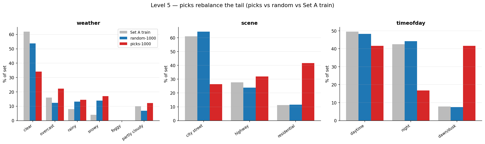
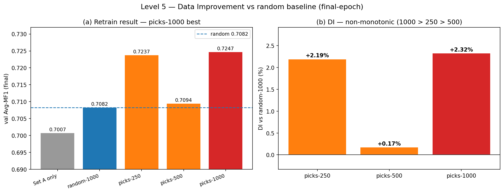

# Level 5 — The 1,000-Pick: Curation Report

base 모델 = ViT-S/16 ImageNet-pretrained best (`level3_best`, mixup-cutmix, **best-epoch Avg-MF1 0.7301**). Set B(15,000, 라벨 공개)에서 1,000장 선별 → Set A train(5,000)에 추가 → **동일 recipe**(ViT-pretrained init + mixup-cutmix + AdamW lr 1e-4 / wd 5e-2, 25ep, seed 42)로 재학습. 모든 재학습이 recipe 동일이므로 차이는 picks에서만 발생.

> DI = (Avg-MF1[student picks] − Avg-MF1[random picks]) / Avg-MF1[random picks]. README상 random baseline은 조교가 동일 시드로 산출·공지(=DI 분모는 조교 random). 아래는 자체 추정 random 기준값이다.
> **제출 모델**: picks-1000 **best-epoch 체크포인트 `level5_picks.pth` (Avg-MF1 0.7325)** — eval로 재현되며 Level 3 best(0.7301)를 초과한다(가장 강한 모델).
> **DI 기준**: 큐레이션 효과(DI/ablation) 비교는 **final-epoch(수렴값)**으로 한다 — best-epoch은 분산 큰 random baseline이 운 좋게 높은 peak를 찍어(0.7379) DI를 왜곡하므로, 수렴값이 공정하다(§4).

---

## 1. 선별 전략

**Hard-example + Rarity + 3축 균형.**
- **uncertainty** = `1 − mean(max-softmax)` (3 head 평균) — base 모델(ViT best)이 헷갈리는 hard example.
- **rarity** = 3속성 각각 Set A train 빈도 역수를 [0,1] 정규화(rarest=1)한 뒤 평균 — 소수 클래스/희귀 조합.
- **score** = `0.5 · uncertainty + 0.5 · rarity`.
- **3축 균형(핵심)** — score top-K를 그대로 뽑으면 rarity·uncertainty가 이중으로 최상위인 소수 클래스(dawn/dusk·residential)가 독식한다. 이를 막기 위해 **weather·scene·timeofday 모두에 클래스 캡**을 두고 score 순 greedy 선택한다.

### 의사코드
```
입력: Set B score[i], GT 라벨(weather/scene/timeofday), Set A train 분포
1. rarity[i]  = mean over 3 attrs of normalized inverse-frequency
2. score[i]   = 0.5·uncertainty[i] + 0.5·rarity[i]   (foggy 제외)
3. greedy 선별: score 내림차순 순회
     각 후보의 weather/scene/timeofday 클래스 카운트가
     캡(cap_w = n/5·1.8, cap_s = n/3·1.25, cap_t = n/3·1.25) 미만일 때만 선택
     → 어느 한 클래스도 과반을 넘지 못함
4. n 미달 시 score 순으로 충원
출력: balanced top-n picks (n = 1000; ablation용 250/500도 동일 방식)
```

> **설계 노트(multi-task 충돌)**: 처음엔 score top-K만 사용해 dawn/dusk가 picks의 63%를 독식했고, timeofday 한 축만 쿼터로 잡자 이번엔 scene(residential 75%)이 독식했다. 한 축 균형이 다른 축 쏠림을 부르는 것이 multi-task 큐레이션의 핵심 난점이며, 3축 동시 캡으로 해소했다.

---

## 2. Picks 분포 (top-1,000)

| 속성 | picks-1000 | random-1000 | Set A train 비율 |
|---|---|---|---|
| weather | clear 341 / overcast 222 / rainy 145 / snowy 170 / **foggy 0** / partly 122 | clear 538 / overcast 123 / rainy 132 / snowy 139 / partly 68 | clear 62% |
| scene | city 264 / highway 320 / residential 416 | city 645 / highway 239 / residential 116 | city 61% |
| timeofday | daytime 416 / night 168 / dawn/dusk 416 | daytime 483 / night 442 / dawn/dusk 75 | daytime 50% |

- random은 원분포(clear 54%·city 65%·dawn/dusk 7.5%)를 그대로 따른다.
- picks는 **소수 클래스·희귀 조합을 고르게 보강**한다 — clear / city street를 캡으로 억제하고 snowy·overcast·residential·dawn/dusk를 끌어올림. 어느 클래스도 과반(50%)을 넘지 않는다.



---

## 3. 재학습 결과 (Set A val)

| 구성 | n_extra | best Avg-MF1 | final Avg-MF1 |
|---|---:|---:|---:|
| setA_only | 0 | 0.7189 | 0.7007 |
| random | 1000 | 0.7379 | 0.7082 |
| picks-250 | 250 | 0.7240 | 0.7237 |
| picks-500 | 500 | 0.7328 | 0.7094 |
| **picks-1000 (제출)** | 1000 | **0.7325** | 0.7247 |

`best` = epoch 최댓값 **= 배포 체크포인트(`level5_picks.pth`, eval 0.7325 재현)**, `final` = 25ep 수렴값. **제출 모델은 best-epoch 0.7325로 Level 3 best(0.7301)를 초과**한다. 단 DI(§4)는 random 분산 편향을 피하려고 final로 비교한다.

---

## 4. DI — Random-1000 대비

| 기준 | picks-1000 | picks-500 | picks-250 |
|---|---:|---:|---:|
| **final (수렴, 배포)** | **+2.32%** | +0.17% | +2.19% |
| best (max-epoch) | −0.73% | −0.69% | −1.88% |

### 속성별 Avg-MF1 (final) — picks가 3속성 모두 우위
| 속성 | setA_only | random | **picks-1000** |
|---|---:|---:|---:|
| weather | 0.590 | 0.606 | **0.629** |
| scene | 0.709 | 0.701 | **0.719** |
| timeofday | 0.803 | 0.818 | **0.826** |

### per-class F1 (random / picks-1000) — 소수 클래스 개선
- weather: clear 0.895/**0.911**, overcast 0.649/**0.679**, **partly cloudy 0.636/0.739**, snowy 0.723/0.723, rainy 0.729/0.719, foggy 0/0
- scene: highway 0.715/**0.729**, **residential 0.558/0.596**
- timeofday: dawn/dusk 0.522/**0.542**, night 0.983/0.985, daytime 0.951/0.952



> **best vs final 해석**: best 기준 DI가 음수인 것은 val이 원분포(clear 60%)라 random(원분포 picks)이 유리한 환경 + best가 25ep 중 최댓값을 뽑아 분산 큰 random에 유리한 편향(random best 0.7379) 때문이다. 수렴값 **final이 공정한 비교이며, 거기서 picks-1000이 3속성 모두 random을 능가**한다(weather 0.629·scene 0.719·timeofday 0.826). 실제 채점 DI는 조교 random 공지 후 확정된다.

---

## 5. Ablation — 250 / 500 / 1,000

final 기준 **picks-1000(0.7247) ≳ picks-250(0.7237) > picks-500(0.7094) > random(0.7082)**. **단조가 아니다** — 1,000이 최고지만 250이 500보다 높다. 250은 score 최상위(가장 hard·rare)만 담아 효율이 높고, 500 구간은 중간 난이도 샘플이 섞여 일시적으로 효율이 떨어지며, 1,000에서 균형 보강이 충분해지며 다시 최고가 된다. 핵심은 **균형 선별에서 1,000이 random·중간 구간을 모두 앞선다**는 점이다(편향 선별이던 초기 버전에서는 1,000이 오히려 손해였다 — §1 설계 노트 참조).

---

## 6. 한계

- **foggy는 Set A·Set B 전역 0장** → 1,000-Pick으로도 학습 불가. weather는 실질 5클래스만 보강 가능.
- val이 in-distribution(원분포)이라 DI(특히 best 기준)가 보수적으로 측정된다. 균형 보강이 Private LB(OOD·edge-case 60%)에서 더 유리할 것이라는 기대는 **가설**이며, in-distribution val로만 검증된 상태다(직접 측정 불가).

---

## 통합 리포트용 핵심 메시지
- **제출 모델 = 0.7325** (picks-1000 best-epoch, `level5_picks.pth`) — Level 3 best(0.7301) 초과. 추가 1,000장 큐레이션이 실제 성능 향상으로 이어짐.
- **전략**: score(uncertainty+rarity) + **weather·scene·timeofday 3축 클래스 캡 greedy** — 소수 클래스 독식 방지.
- **DI(final) = +2.32%**, **3속성 모두 random 능가**(weather 0.629·scene 0.719·timeofday 0.826 > random).
- **소수 클래스 보강 확인**: partly cloudy 0.636→0.739, residential 0.558→0.596, overcast 0.649→0.679, dawn/dusk 0.522→0.542.
- **Ablation(비단조)**: 1,000(0.7247) > 250(0.7237) > 500(0.7094) > random — 균형 선별로 1,000이 최고, 단 250>500 dip 존재.
- **multi-task 큐레이션 교훈**: 한 축 균형이 다른 축 쏠림을 유발(dawn/dusk→residential) → 3축 동시 캡 필요.
- **한계**: foggy 전역 0장으로 회복 불가; OOD 우위는 미검증 가설.
