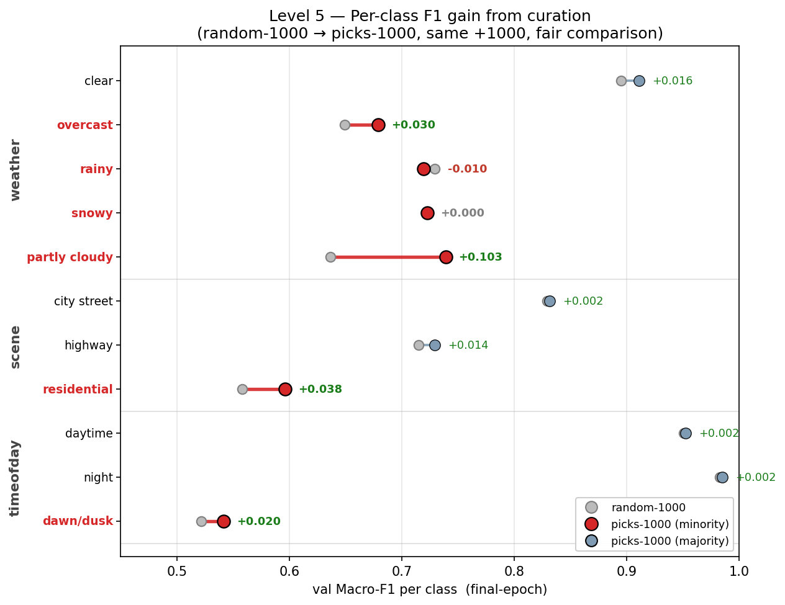

# Level 5 — The 1,000-Pick: Curation Report

base 모델 = ViT-S/16 ImageNet-pretrained best (`level3_best`, mixup-cutmix, **best-epoch Avg-MF1 0.7301**). Set B(15,000, 라벨 공개)에서 1,000장 선별 → Set A train(5,000)에 추가 → **동일 recipe**(ViT-pretrained init + mixup-cutmix + AdamW lr 1e-4 / wd 5e-2, 25ep, seed 42)로 재학습. 모든 재학습이 recipe 동일이므로 차이는 picks에서만 발생.

> DI = (Avg-MF1[student picks] − Avg-MF1[random picks]) / Avg-MF1[random picks]. README상 random baseline은 조교가 동일 시드로 산출·공지(=DI 분모는 조교 random). 아래는 자체 추정 random 기준값이다.
> **제출 모델**: picks-1000 **best-epoch 체크포인트 `level5_picks.pth` (Avg-MF1 0.7325)** — eval로 재현되며 Level 3 best(0.7301)를 초과한다(가장 강한 모델).
> **DI 기준**: 큐레이션 효과(DI/ablation) 비교는 **final-epoch(수렴값)**으로 한다 — best-epoch은 분산 큰 random baseline이 운 좋게 높은 peak를 찍어(0.7379) DI를 왜곡하므로, 수렴값이 공정하다(§4).

---

## 1. 선별 전략

**목표**: Set B 15,000장 중 학습 효과가 가장 큰 **1,000장** 선별. 쉽고 흔한 이미지는 모델이 이미 잘 맞혀서 더 배울 게 없다 → **(1) 모델이 어려워하고 (2) 드문** 이미지를 우선한다. 두 신호를 각각 0~1 점수로 만들어 합치고(score), 한 클래스가 1,000장을 독식하지 않도록 정원(cap)으로 균형을 잡는다.

### ① uncertainty — "모델이 얼마나 헷갈리는가"

base 모델(ViT best)로 Set B 이미지 한 장 `x`를 예측하면 head마다 softmax 확률 분포가 나온다. 그 head의 **1등 확률**(가장 확신하는 클래스의 확률)이 곧 그 속성에 대한 확신도다. 3 head의 확신도를 평균내고 1에서 빼면 불확실도가 된다:

```
confidence(x)  = (1/3) · Σ_a  max_c  p_a(c | x)        a ∈ {weather, scene, timeofday}
uncertainty(x) = 1 − confidence(x)
```

- `max_c p_a(c|x)` = head `a`가 1등으로 찍은 클래스의 확률(0~1). 1에 가까울수록 확신.
- 예) head별 1등 확률이 weather 0.55 / scene 0.60 / timeofday 0.62인 이미지 → confidence 0.59 → **uncertainty 0.41**(헷갈림). 반대로 0.97 / 0.95 / 0.96인 쉬운 이미지 → confidence 0.96 → **uncertainty 0.04**.
- *왜*: 모델이 이미 확신하는 샘플은 추가해도 새로 배울 게 없다. **헷갈리는 샘플이 정보량이 가장 크다**(틀리는 문제를 풀어야 실력이 는다 = hard-example mining).

### ② rarity — "얼마나 드문 클래스인가"

각 속성에서 그 이미지가 속한 클래스가 **Set A train에 몇 장 있었는지**(빈도)를 보고, 적을수록 높은 점수를 준다. 속성 `a`, 클래스 `k`의 학습 빈도를 `n_a(k)`라 하면:

```
rar_a(k)   = (1 / n_a(k)) / max_j (1 / n_a(j))  =  n_a(rarest) / n_a(k)      가장 드문 클래스 = 1.0
rarity(x)  = (1/3) · Σ_a  rar_a( class_a(x) )                                 3속성 평균
```

즉 **가장 드문 클래스가 1.0, 흔할수록 0에 가깝다**. Set A train 실측 빈도로 계산하면:

| 속성 | 드묾 → 흔함 (rarity 값) |
|---|---|
| scene | residential 1.00 > highway 0.40 > city street 0.18 |
| timeofday | dawn/dusk 1.00 > night 0.18 > daytime 0.16 |

- 예) **residential·dawn/dusk** 조합 이미지 → rarity ≈ mean(…, 1.00, 1.00) ≈ **0.67**(매우 높음). **city street·daytime** 흔한 이미지 → rarity ≈ mean(…, 0.18, 0.16) ≈ **0.11**(낮음).
- *왜*: 모델은 **학습 데이터가 적은 클래스에서 약하다**. 드문 클래스를 보강하면 불균형이 직접 줄어든다.

> **참고 — weather rarity는 의도적으로 약하게 작동한다.** foggy가 train 0장이라 위 식에서 `1/clamp(0,1)=1.0`이 정규화 최댓값을 차지해, 나머지 weather 클래스 rarity가 ≤0.005로 압축된다. 따라서 **weather 균형은 rarity가 아니라 ④의 cap(cap_w)** 이 책임진다(scene·timeofday는 정상 동작).

### ③ score — 두 신호를 반반 합산

```
score(x) = 0.5 · uncertainty(x) + 0.5 · rarity(x)       λ = 0.5,  foggy는 score = −1 로 제외
```

헷갈리면서(①↑) **동시에** 드문(②↑) 샘플이 최고점이 된다. 위 예시로:
- 드물고-헷갈린 이미지: `0.5·0.41 + 0.5·0.67 = `**`0.54`**
- 흔하고-쉬운 이미지: `0.5·0.04 + 0.5·0.11 = `**`0.08`**  → 약 **7배** 차이.

### ④ 3축 균형 (cap) — multi-task 특유의 난점

score 상위만 그냥 뽑으면, **dawn/dusk·residential** 같은 클래스는 *드물고(②↑) + 헷갈려서(①↑)* score가 양쪽 모두 최상위 → 1,000장을 독식해 **또 다른 불균형**을 만든다. 한 속성만 균형 잡으면 다른 속성이 쏠린다. 그래서 **세 속성 모두에 클래스 정원(cap)** 을 두고, score 내림차순으로 훑되 후보의 weather/scene/timeofday 중 **하나라도 정원이 찼으면 건너뛴다**(greedy). n=1,000일 때 정원은:

```
cap_weather   = ⌊ n/5 · 1.8  ⌋ = 360      foggy 제외 5클래스, 균등치(n/5=200)의 1.8배까지 허용
cap_scene     = ⌊ n/3 · 1.25 ⌋ = 416
cap_timeofday = ⌊ n/3 · 1.25 ⌋ = 416
```

- 곱하는 계수(1.8, 1.25)는 "완전 균등(= n / 클래스수)"보다 약간 느슨하게 풀어, 흔하지만 정보량 있는 샘플도 어느 정도 담되 **과반은 못 넘게** 한 값이다. 그 결과 어떤 클래스도 1,000장의 절반을 못 넘는다(§2 분포: 최대가 residential / dawn/dusk 416, clear 341).
- 뷔페 비유: "맛있는 것(score 높은 것)부터 담되, **한 메뉴는 N접시까지만**."

### 의사코드
```
입력: Set B의 score[i], GT 라벨(weather/scene/timeofday), Set A train 빈도
1. confidence[i] = mean_a( max_c softmax_a(x_i) );   uncertainty[i] = 1 − confidence[i]
2. rarity[i]     = mean_a( rar_a(class_a(i)) )        # rar_a = 빈도 역수, 속성별 [0,1] 정규화
3. score[i]      = 0.5·uncertainty[i] + 0.5·rarity[i] # foggy → −1 (제외)
4. greedy 선별: score 내림차순 순회
     후보의 weather/scene/timeofday 클래스 카운트가
     cap_w(360) / cap_s(416) / cap_t(416) 미만일 때만 선택
5. cap으로 n 미달 시 score 순으로 충원
출력: balanced top-n picks (n=1000; ablation용 250/500도 동일, cap만 비례 축소)
```

> **설계 노트(multi-task 충돌)**: 처음엔 score top-K만 사용해 dawn/dusk가 picks의 63%를 독식했고, timeofday 한 축만 쿼터로 잡자 이번엔 scene(residential 75%)이 독식했다. 한 축 균형이 다른 축 쏠림을 부르는 것이 multi-task 큐레이션의 핵심 난점이며, **3축 동시 cap**으로 해소했다.

---

## 2. Picks 분포 (top-1,000)

| 속성 | picks-1000 | random-1000 | Set A train 비율 |
|---|---|---|---|
| weather | clear 341 / overcast 222 / rainy 145 / snowy 170 / **foggy 0** / partly 122 | clear 538 / overcast 123 / rainy 132 / snowy 139 / partly 68 | clear 62% |
| scene | city 264 / highway 320 / residential 416 | city 645 / highway 239 / residential 116 | city 61% |
| timeofday | daytime 416 / night 168 / dawn/dusk 416 | daytime 483 / night 442 / dawn/dusk 75 | daytime 50% |

- random은 원분포(clear 54%·city 65%·dawn/dusk 7.5%)를 그대로 따른다.
- picks는 **소수 클래스·희귀 조합을 고르게 보강**한다 — clear / city street를 캡으로 억제하고 snowy·overcast·residential·dawn/dusk를 끌어올림. 어느 클래스도 과반(50%)을 넘지 않는다.


---

## 3. 재학습 결과 (Set A val)

| 구성 | n_extra | best Avg-MF1 | final Avg-MF1 |
|---|---:|---:|---:|
| setA_only | 0 | 0.7189 | 0.7007 |
| random | 1000 | 0.7379 | 0.7082 |
| picks-250 | 250 | 0.7240 | 0.7237 |
| picks-500 | 500 | 0.7328 | 0.7094 |
| **picks-1000 (제출)** | 1000 | **0.7325** | 0.7247 |

`best` = epoch 최댓값 **= 배포 체크포인트(`level5_picks.pth`, eval 0.7325 재현)**, `final` = 25ep 수렴값. **제출 모델은 best-epoch 0.7325로 Level 3 best(0.7301)를 초과**한다. 단 DI(§4)는 random 분산 편향을 피하려고 final로 비교한다.

---

## 4. DI — Random-1000 대비

| 기준 | picks-1000 | picks-500 | picks-250 |
|---|---:|---:|---:|
| **final (수렴, 배포)** | **+2.32%** | +0.17% | +2.19% |
| best (max-epoch) | −0.73% | −0.69% | −1.88% |

### 속성별 Avg-MF1 (final) — picks가 3속성 모두 우위
| 속성 | setA_only | random | **picks-1000** |
|---|---:|---:|---:|
| weather | 0.590 | 0.606 | **0.629** |
| scene | 0.709 | 0.701 | **0.719** |
| timeofday | 0.803 | 0.818 | **0.826** |

### per-class F1 (random / picks-1000) — 소수 클래스 개선
- weather: clear 0.895/**0.911**, overcast 0.649/**0.679**, **partly cloudy 0.636/0.739**, snowy 0.723/0.723, rainy 0.729/0.719, foggy 0/0
- scene: highway 0.715/**0.729**, **residential 0.558/0.596**
- timeofday: dawn/dusk 0.522/**0.542**, night 0.983/0.985, daytime 0.951/0.952



> **그림 — 큐레이션의 클래스별 F1 향상** (random-1000 → picks-1000, 둘 다 +1,000장이라 차이는 **큐레이션 효과만**, final-epoch). **소수 클래스(빨강)가 향상을 독점**한다: partly cloudy **+0.103**, residential +0.038, overcast +0.030, dawn/dusk +0.020. 다수 클래스(파랑)는 이미 0.83~0.98로 **포화**돼 변화가 미미(+0.002~+0.016). 유일한 하락 rainy −0.010은 소수↔소수 cross-attribute trade-off(§ Level 3 분석과 동일 패턴). 즉 큐레이션이 **약한 소수 클래스를 골라 끌어올리고 다수는 건드리지 않았다**.


> **best vs final 해석**: best 기준 DI가 음수인 것은 val이 원분포(clear 60%)라 random(원분포 picks)이 유리한 환경 + best가 25ep 중 최댓값을 뽑아 분산 큰 random에 유리한 편향(random best 0.7379) 때문이다. 수렴값 **final이 공정한 비교이며, 거기서 picks-1000이 3속성 모두 random을 능가**한다(weather 0.629·scene 0.719·timeofday 0.826). 실제 채점 DI는 조교 random 공지 후 확정된다.

---

## 5. Ablation — 250 / 500 / 1,000

final 기준 **picks-1000(0.7247) ≳ picks-250(0.7237) > picks-500(0.7094) > random(0.7082)**. **단조가 아니다** — 1,000이 최고지만 250이 500보다 높다. 250은 score 최상위(가장 hard·rare)만 담아 효율이 높고, 500 구간은 중간 난이도 샘플이 섞여 일시적으로 효율이 떨어지며, 1,000에서 균형 보강이 충분해지며 다시 최고가 된다. 핵심은 **균형 선별에서 1,000이 random·중간 구간을 모두 앞선다**는 점이다(편향 선별이던 초기 버전에서는 1,000이 오히려 손해였다 — §1 설계 노트 참조).

---

## 6. 한계

- **foggy는 Set A·Set B 전역 0장** → 1,000-Pick으로도 학습 불가. weather는 실질 5클래스만 보강 가능.
- val이 in-distribution(원분포)이라 DI(특히 best 기준)가 보수적으로 측정된다. 균형 보강이 Private LB(OOD·edge-case 60%)에서 더 유리할 것이라는 기대는 **가설**이며, in-distribution val로만 검증된 상태다(직접 측정 불가).

---

## 통합 리포트용 핵심 메시지
- **제출 모델 = 0.7325** (picks-1000 best-epoch, `level5_picks.pth`) — Level 3 best(0.7301) 초과. 추가 1,000장 큐레이션이 실제 성능 향상으로 이어짐.
- **전략**: score(uncertainty+rarity) + **weather·scene·timeofday 3축 클래스 캡 greedy** — 소수 클래스 독식 방지.
- **DI(final) = +2.32%**, **3속성 모두 random 능가**(weather 0.629·scene 0.719·timeofday 0.826 > random).
- **소수 클래스 보강 확인**: partly cloudy 0.636→0.739, residential 0.558→0.596, overcast 0.649→0.679, dawn/dusk 0.522→0.542.
- **Ablation(비단조)**: 1,000(0.7247) > 250(0.7237) > 500(0.7094) > random — 균형 선별로 1,000이 최고, 단 250>500 dip 존재.
- **multi-task 큐레이션 교훈**: 한 축 균형이 다른 축 쏠림을 유발(dawn/dusk→residential) → 3축 동시 캡 필요.
- **한계**: foggy 전역 0장으로 회복 불가; OOD 우위는 미검증 가설.
